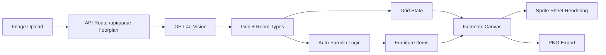

# hackajohn
Hackathon 7 Feb 2026

## Iso Room Planner
A first-pass prototype that turns a floor plan into an isometric room and lets you drag furniture around.

### Setup
1. Run `npm install`
2. Run `npm run dev`

`isometric-city` is linked as a local file dependency via `file:./packages/isometric-city`.

---

## Sprint Plan (2.5 hours)

Transform the manual grid editor into a wow-worthy demo by adding AI-powered floor plan image upload, sprite-based isometric rendering, and auto-furnishing -- the three features that will make the demo go from "nice prototype" to "this is magic".

### Current State

Working isometric room planner at `src/components/RoomPlanner.tsx` with:

- Manual 2D grid editor (12x8) with floor/erase/furniture tools
- Canvas-based isometric 3D view with walls, floor tiles, and colored-box furniture
- Drag-and-drop furniture (sofa, bed, table, chair, plant) with collision detection
- Uses `gridToScreen`/`screenToGrid` from the isometric-city package for coordinate math

**The gap:** The core pitch is "read a 2D floor plan" but there is no image upload or floor plan parsing. Furniture renders as flat colored boxes, not SimCity-style sprites. The isometric-city package has a full sprite system and 10+ sprite sheets sitting unused.

---

### 1. Floor Plan Image Upload + AI Room Detection (~50 min)

**Why:** This IS the product. Without it, you're demo-ing a manual grid editor.

**What to build:**

- Add an image upload zone (drag-and-drop or file picker) above the 2D grid in the left panel
- Create an API route at `src/app/api/parse-floorplan/route.ts` that:
  - Accepts the uploaded image (base64)
  - Sends it to OpenAI GPT-4o Vision (or similar multimodal LLM) with a structured prompt
  - Prompt asks the model to return a JSON grid (boolean[][] for walls/floors) + detected rooms with types (bedroom, kitchen, bathroom, living room, etc.) and bounding boxes
- On response, populate the `grid` state and overlay room labels on the 2D view
- Show a loading spinner during processing

**Key prompt design:** Ask the model to output a fixed-size grid (e.g. 16x12) where `true` = floor, `false` = wall/outside, plus an array of `{ type, x, y, w, h }` for detected rooms.

### 2. Auto-Furnish Rooms by Type (~30 min)

**Why:** Instant wow -- upload a floor plan and furniture appears in the right places.

**What to build:**

- Define furniture presets per room type:
  - Bedroom: bed + plant
  - Living room: sofa + table + plant
  - Kitchen: table + chair
  - Bathroom: (skip or minimal)
- After AI returns room bounding boxes, auto-place appropriate furniture within each room's bounds using `canPlaceItem()` for collision avoidance
- Add "Auto-Furnish" button that re-runs this logic

### 3. Sprite-Based Isometric Rendering (~40 min)

**Why:** Transforms colored boxes into a SimCity-like scene. Massive visual upgrade.

**What to build:**

- Load sprite sheets from `packages/isometric-city/public/assets/` (they have buildings, parks, furniture-like objects)
- Replace the `drawDiamond` floor rendering with textured isometric tiles using sprites
- Replace colored-box furniture with sprite images:
  - Map furniture types to appropriate sprites from the sprite sheets
  - Use the sprite pack config at `packages/isometric-city/src/lib/renderConfig.ts` for sprite coordinates and offsets
- Add image preloading with the existing `imageLoader.ts` pattern

### 4. UI Polish + Export (~25 min)

**Why:** Demo polish wins hackathons.

**What to build:**

- "Download as PNG" button that exports the isometric canvas via `canvas.toDataURL()`
- Room type labels rendered on the isometric view (floating text above each room)
- Subtle entrance animation when floor plan loads (tiles fade/slide in row by row)
- Better status messages with room count, furniture count summary
- Slightly larger default grid (16x12) to support realistic floor plans

### 5. Demo-Ready Preset Floor Plans (~15 min)

**Why:** If the AI API is slow or flaky during demo, you need a fallback.

**What to build:**

- 2-3 hardcoded example floor plans (studio apartment, 2-bedroom, office) as JSON
- "Load Example" dropdown that instantly populates the grid + furniture
- These also serve as a great "before/after" comparison in the demo

---

### Architecture

### Key Files to Modify/Create

- `src/components/RoomPlanner.tsx` -- add upload UI, auto-furnish, sprite rendering, export
- `src/app/api/parse-floorplan/route.ts` -- new API route for AI floor plan parsing
- `src/app/globals.css` -- upload zone styles, animation keyframes

### Risk Mitigation

- If GPT-4o Vision is unavailable: fall back to hardcoded example plans (item 5)
- If sprite rendering takes too long: keep the colored-box approach but add gradients and shadows for a "good enough" visual upgrade
- If time runs short: items 1 + 2 alone (AI upload + auto-furnish) are a complete demo story
