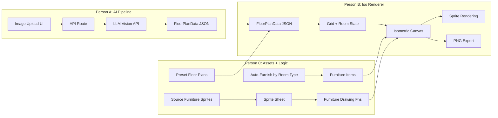

# hackajohn
Hackathon 7 Feb 2026

## Iso Room Planner
A first-pass prototype that turns a floor plan into an isometric room and lets you drag furniture around.

### Setup
1. Run `npm install`
2. Run `npm run dev`

`isometric-city` is linked as a local file dependency via `file:./packages/isometric-city`.

---

## Sprint Plan -- 3 Parallel Workstreams (2.5 hours)

Transform the manual grid editor into a wow-worthy demo by adding AI-powered floor plan image upload, sprite-based isometric rendering, and auto-furnishing. Team of 3, divide and conquer.

### Current State

Working isometric room planner at `src/components/RoomPlanner.tsx` with:

- Manual 2D grid editor (12x8) with floor/erase/furniture tools
- Canvas-based isometric 3D view with walls, floor tiles, and colored-box furniture
- Drag-and-drop furniture (sofa, bed, table, chair, plant) with collision detection
- Uses `gridToScreen`/`screenToGrid` from the isometric-city package for coordinate math

**The gap:** No image upload or floor plan parsing. Furniture renders as flat colored boxes. The isometric-city package has sprites sitting unused, and we need new pixel-art furniture assets.

---

### Shared JSON Schema (agree FIRST, ~5 min, all 3)

Everyone works against this contract in `src/types/floorplan.ts`:

```typescript
type FloorPlanData = {
  grid: boolean[][];  // e.g. 16x12, true = floor, false = wall/outside
  rooms: Room[];
};

type Room = {
  type: 'bedroom' | 'living_room' | 'kitchen' | 'bathroom' | 'hallway' | 'office';
  label: string;       // "Master Bedroom", "Kitchen", etc.
  x: number; y: number; // top-left grid coord of bounding box
  w: number; h: number; // width/height in grid cells
};
```

---

### Architecture



---

### Person A: AI Pipeline (backend-focused)

**Files:** `src/app/api/parse-floorplan/route.ts` (new), upload UI in `src/components/RoomPlanner.tsx`

**Goal:** Upload an image, get back `FloorPlanData` JSON, feed it into state.

1. **Create shared types file** `src/types/floorplan.ts` (~5 min)
2. **Build API route** at `src/app/api/parse-floorplan/route.ts` (~30 min)
   - Accept POST with base64 image
   - Call LLM vision API with structured prompt asking for 16x12 boolean grid + rooms array
   - Parse response, validate, return `FloorPlanData`
3. **Add upload UI to RoomPlanner** (~25 min)
   - Drag-and-drop zone + file picker above the 2D grid
   - Image preview thumbnail, loading spinner
   - On success: call `onFloorPlanParsed(data: FloorPlanData)`
4. **Error handling + retry** (~10 min)
   - Error toast for bad JSON, "Try Again" button
5. **Test with real floor plan images** (~10 min)

**Dependencies on others:** None.

---

### Person B: Isometric Renderer + Polish (frontend/canvas-focused)

**Files:** `src/components/RoomPlanner.tsx` (iso canvas section), `src/app/globals.css`

**Goal:** Make the iso view accept `FloorPlanData`, render room labels, support dynamic grid sizes, add export.

1. **Wire `FloorPlanData` into state** (~15 min)
   - `onFloorPlanParsed` handler updates `grid` and stores `rooms: Room[]`
   - Support dynamic grid sizes (not just 12x8)
2. **Render room labels on iso view** (~20 min)
   - Calculate room center, convert to screen coords via `gridToScreen`
   - Draw floating labels with background pill, color-coded by room type
3. **Room-colored floor tiles** (~15 min)
   - Color-code floor diamonds by room type (bedroom=blue, kitchen=yellow, etc.)
4. **PNG export** (~10 min)
   - "Download as PNG" button using `canvas.toDataURL('image/png')`
5. **Entrance animation** (~10 min)
   - Tiles appear row-by-row with staggered fade-in on new floor plan load
6. **Integrate Person C's sprite drawing functions** (~10 min)

**Dependencies:** Shared types from Person A (step 1). Sprite functions from Person C (step 6, do last).

---

### Person C: Assets + Auto-Furnish + Presets (art/logic-focused)

**Files:** `src/lib/sprites.ts` (new), `src/lib/presets.ts` (new), auto-furnish logic in `RoomPlanner.tsx`

**Goal:** Source pixel-art furniture sprites, build auto-furnish logic, create fallback presets.

1. **Source pixel-art isometric furniture sprites** (~25 min)
   - Existing sprites are city buildings (64px, pixelated, isometric). Need matching furniture.
   - Sources: [Kenney.nl](https://kenney.nl), [OpenGameArt.org](https://opengameart.org), [itch.io free isometric](https://itch.io/game-assets/free/tag-isometric)
   - Need: sofa, bed, table, chair, plant, bookshelf, desk, TV, fridge, bathtub, stove
   - Target: ~64-128px wide PNGs, place in `public/assets/furniture/`
2. **Build sprite loading + drawing** in `src/lib/sprites.ts` (~20 min)
   - Image preloader for all furniture PNGs
   - Export `drawFurnitureSprite(ctx, type, screenX, screenY, w, h)`
   - Map `FurnitureType` to sprite paths, handle scaling
3. **Auto-furnish logic** (~20 min)
   - `autoFurnish(grid, rooms): FurnitureItem[]`
   - Presets: bedroom=bed+plant, living_room=sofa+table+plant, kitchen=table+chairs, office=desk+chair
   - Use `canPlaceItem()` for collision avoidance
   - "Auto-Furnish" button in UI
4. **Preset floor plans** in `src/lib/presets.ts` (~15 min)
   - 2-3 hardcoded `FloorPlanData`: studio apartment, 2-bedroom, small office
   - "Load Example" dropdown in UI

**Dependencies on others:** None.

---

### Timeline

| Time | Person A (AI Pipeline) | Person B (Iso Renderer) | Person C (Assets + Logic) |
|------|----------------------|------------------------|--------------------------|
| 0:00 | Agree on JSON schema together (5 min) | | |
| 0:05 | API route + LLM prompt | Wire FloorPlanData, room labels | Source furniture sprites |
| 0:45 | Upload UI + error handling | Room-colored tiles, PNG export | Sprite loading + drawing fns |
| 1:15 | Test with real images | Entrance animation | Auto-furnish + presets |
| 1:45 | Integration + end-to-end testing (all 3) | | |
| 2:10 | Demo prep, polish, edge cases (all 3) | | |

### Key Files to Modify/Create

- `src/types/floorplan.ts` -- shared JSON schema (new)
- `src/components/RoomPlanner.tsx` -- upload UI, state wiring, auto-furnish button
- `src/app/api/parse-floorplan/route.ts` -- AI floor plan parsing (new)
- `src/lib/sprites.ts` -- furniture sprite loading + drawing (new)
- `src/lib/presets.ts` -- hardcoded example floor plans (new)
- `src/app/globals.css` -- upload zone styles, animation keyframes
- `public/assets/furniture/` -- pixel-art furniture sprite PNGs (new)

### Risk Mitigation

- **LLM API issues:** Person C's presets ensure a working demo regardless
- **Can't find good sprites:** Keep colored-box approach but add gradients + shadows (15 min fix)
- **Integration hiccups:** JSON contract minimizes these -- each person can test independently with hardcoded data
- **Time runs short:** Items Person A + Person C auto-furnish alone = complete demo story
